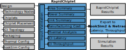

# RapidChiplet

<p align="center">
  
</p>

## Setup Guide

Clone the RapidChiplet repository:
```bash
git clone https://github.com/spcl/rapid_chiplet.git
```

Install all requirements using pip:
```bash
cd rapid_chiplet
pip install -r requirements.txt
```

Build the BookSim2 [1,2] simulator:
```bash
cd booksim2/src
make
```

## Reproducing results from the RapidChiplet paper [3]

```bash
python3 reproduce_results_from_paper.py
```

The resulting plots will be stored in the `./plots/` directory. 
Note that this script runs for multiple hours.
The results might slightly differ from the paper due to different system specifications.

## Usage

### Inputs

Configure your chip design using the seven different input files. Check out the example files in `./inputs/` and the input description in the paper [3] to get started.

### Visualization

Visualizations of chiplets and chip designs will be stored in the `./visualizations/` directory.

Visualize a chiplet:
```bash
python3 chiplet_visualizer.py -cf <chiplet-file> -cn <chiplet-name>
```

Example:
```bash
python3 chiplet_visualizer.py -cf inputs/chiplets/example_chiplets.json -cn compute_chiplet_4phys
```

Visualize a chip design:
```bash
python3 design_visualizer.py -df <design-file> 
```

Example:
```bash
python3 design_visualizer.py -df inputs/designs/example_design.json
```

### Computation of Target Metrics

Each of the seven metrics can be toggled ON using a command line flag. For a summary of flags, run:
```bash
python3 rapid_chiplet.py -h
```

To compute all seven metrics, run:
```bash
python3 rapid_chiplet.py -df <design-file> -rf <results-file> -as -ps -ls -c -T -l -t
```

Example:
```bash
python3 rapid_chiplet.py -df inputs/designs/example_design.json -rf example_results -as -ps -ls -c -T -l -t
```

All results are stored in the `./results/` directory.

### Cycle-Accurate Simulations using BookSim2 [1,2]

```bash
python3 run_booksim_simulation.py -df <design-file> -rf <results_file>
```

Example:
```bash
python3 run_booksim_simulation.py -df inputs/designs/example_design.json -rf example_simulation_results
```

All simulation results are stored in the `./results/` directory.

## Contact

Do you have any questions or did you find a bug? Contact us at patrick.iff@inf.ethz.ch.

## Citation

Did you use RapidChiplet in your work? Feel free to cite us using the following citation:

```bibtex
TODO: Add citation
```

## References

[1] Jiang, N., Becker, D.U., Michelogiannakis, G., Balfour, J., Towles, B., Shaw, D.E., Kim, J. and Dally, W.J., 2013, April. A detailed and flexible cycle-accurate network-on-chip simulator. In 2013 IEEE international symposium on performance analysis of systems and software (ISPASS) (pp. 86-96). IEEE.

[2] https://github.com/booksim/booksim2

[3] TODO: Insert paper citation
