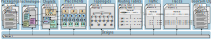

# RapidChiplet

<p align="center">
  
</p>

## Setup Guide

Clone the RapidChiplet repository:
```bash
git clone https://github.com/anonymous-for-blind-review-1/rc.git
```

Install all requirements using pip:
```bash
cd rc 
pip install -r requirements.txt
```

Build the BookSim2 [1,2] simulator:
```bash
cd booksim2/src
make
cd ../../
```

Build Netrace [3,4]
```bash
cd netrace
gcc export_trace.c netrace.c -o export_trace
cd ../
```

## Reproducing Results from the RapidChiplet Paper

```bash
python3 reproduce_paper_results.py
```
- Note that this script runs for almost one day.
- The results might slightly differ from the paper due to different system specifications.
- The plots that appear in the paper in Figure 4 (right), Figure 5, and Figure 6 will be stored in the `./plots/` directory.
- The chip visualization that appears in the paper in Figure 4 (left) will be stored in the `./images/` directory.

## RapidChiplet Core

### Inputs

<p align="center">
  
</p>


Configure your chip design using the different input files. Check out the example files in `./inputs/` to get started.

We provide the following input generation scripts for more complex input-files that cannot easily be written by hand:

**generate_routing.py**: Generates a routing table for a given chip design

```bash
python3 generate_routing.py -df inputs/designs/<design_file> -rtf <routing_table_file> -ra <routing_algorithm>
```
- The `<design file>` points to all inputs that the routing table generator needs (chiplets, placement, topology).
- The `<routing_table_file>` is the name under which the resulting routing table is stored (in `inputs/routing_tables/`).
- `<routing algorithm>` specifies the routing algorithm to be used. We currently support two routing algorithms:
  - `splif`: Shortest Path Lowest ID first
  - `sptmr`: Shortest Path Turn Model Random

**generate_traffic.py**: Generate a synthetic traffic pattern for a given chip design

```bash
python3 generate_traffic.py -df inputs/designs/<design_file> -tf <traffic_file> -tp <traffic_pattern> -par <parameters>
```
- The `<design file>` points to all inputs that the traffic generator needs (chiplets, placement).
- The `<traffic_file>` is the name under which the resulting traffic pattern is stored (in `/inputs/traffic_by_chiplet/` and `inputs/traffic_by_unit/`).
- `<traffic_pattern>` specifies the traffic pattern to be generated. We currently support four traffic patterns: `random_uniform`, `transpose`, `permutation`, `hotspot`.
- `<parameters>` are specific to the selected traffic pattern.

### Executing RapidChiplet

```bash
python3 rapidchiplet.py -df inputs/designs/<design_file> -rf <results_file> [-as] [-ps] [-ls] [-c] [-l] [-t]
```
- The `<design_file>` points to all inputs that are required
- The `<results_file>` specifies the name, under which the results are stored (in `/results/`).
- The optional flags are used to enable the computation of different metrics: area summary (`-as`), power summary (`-ps`), link summary (`-ls`), manufacturing cost (`-c`), latency (`-l`), throughput (`-t`).

## Cycle-based Simulations using BookSim

To export a design to BookSim and gather the results, simply run `rapidchiplet.py` with the `-bs` flag:

```bash
python3 rapidchiplet.py -df inputs/designs/<design_file> -rf <results_file> -bs
```
- The `<design_file>` points to all inputs that are required.
- The `<results_file>` specifies the name, under which the results are stored (in `/results/`).

## Automated Design Space Exploration

### Inputs

Specify parameters and parameter-ranges for your design space exploration in an experiment-file in the `./experiments/` directory. Check out the provided example files to get started.


### Running the Automated DSE

```bash
python3 run_experiment.py -e experiments/<experiment_file>
```

This script generates one results-file for each combination of input parameters. All result-files are stored in `./results/`.

## Exporting Network Traces using Netrace

### Inputs

Download the traces from the netrace website [5] and store them in `./netrace/traces_in/`.

### Export traces

In a first step, export the traces from the netrace format into an intermediate format:

```bash
cd netrace
./export_trace traces_in/<trace_name>.tra.bz2 <trace_region_id> <packet_limit> > traces_out/<trace_name>.json
cd ../
```

- Netrace traces contain one or multiple trace regions. Use the `<trace_region_id>` argument to specify the region to export. If you want to export the whole trace, omit this argument.
- Some Netrace traces are very long. If you only want to export a partial trace region, use the `<packet_limit>` argument to pass the maximum number of packets that should be exported.

In a second step, the trace is parsed into the RapidChiplet format:

```bash
python3 parse_netrace_trace.py -df inputs/designs/<design_file> -if netrace/traces_out/<trace_name>.json -of <trace_name>.json
```

- The `<design file>` points to all inputs that the trace parser needs.
- The arguments `-if` and `-of` refer to the input-trace-file (in the intermediate format) and the output-trace-file (in the output format). The output trace file is stored in `inputs/traces/`.


## Visualization of Inputs and Results

### Visualizing Inputs

Visualize a complete design by running

```bash
python3 visualizer.py -df inputs/designs/<design_name> [-sci] [-spi]
```
- You can show chiplet-IDs and PHY-IDs by passing the `-sci` and `-spi` flags respectively.


You can also visualize a single chiplet by running

```bash
python3 visualizer.py -cf inputs/chiplets/<chiplet_file> -cn <chiplet_name>
```

- `<chiplet_file>` is an input file which potentially specifies multiple chiplets and `<chiplet_name>` is the name of one specific chiplet within this file.

### Visualizing Results

Visualize the results by running:

```bash
python3 create_plots.py -rf results/<results-file> -pt <plot_type>
```

- The `<results_file>` contains the results you want to visualize.
- Currently, only one plot type, namely, `latency_vs_load` is supported, but more will be added soon.


## References

[1] Jiang, N., Becker, D.U., Michelogiannakis, G., Balfour, J., Towles, B., Shaw, D.E., Kim, J. and Dally, W.J., 2013, April. A detailed and flexible cycle-accurate network-on-chip simulator. In 2013 IEEE international symposium on performance analysis of systems and software (ISPASS) (pp. 86-96). IEEE.

[2] https://github.com/booksim/booksim2

[3] Hestness, J., Grot, B. and Keckler, S.W., 2010, December. Netrace: dependency-driven trace-based network-on-chip simulation. In Proceedings of the Third International Workshop on Network on Chip Architectures (pp. 31-36).

[4] https://github.com/booksim/netrace

[5] https://www.cs.utexas.edu/~netrace/
